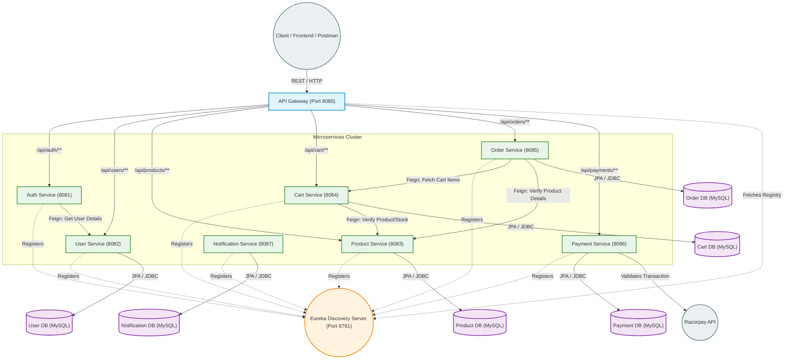

# Smart Cart Architecture Diagram

This architecture visually maps out the internal design of the **Smart Cart** microservices ecosystem. It details how the API Gateway manages ingress traffic, the Discovery Server connects nodes, how internal services query dependencies using Feign, and the dedicated MySQL databases holding independent state.

### Key Highlights
- **Single Point of Entry:** The **API Gateway** intercepts all client requests, executing rate limiting, global CORS processing, and delegating traffic to specific sub-systems.
- **Service Registration:** Every single node registers itself with **Eureka**. This dynamically allows the API Gateway and internally communicating services to find instance IP assignments safely on the fly.
- **Independent State Management:** Following genuine microservices philosophies, bounded contexts correctly manage their own unique **MySQL Databases**.
- **Internal RPC (Feign):** The graph visually demonstrates the newly load-balanced lines of internal requests connecting disparate microservice ecosystems securely (e.g. `Order` service directly talking to `Cart`).
